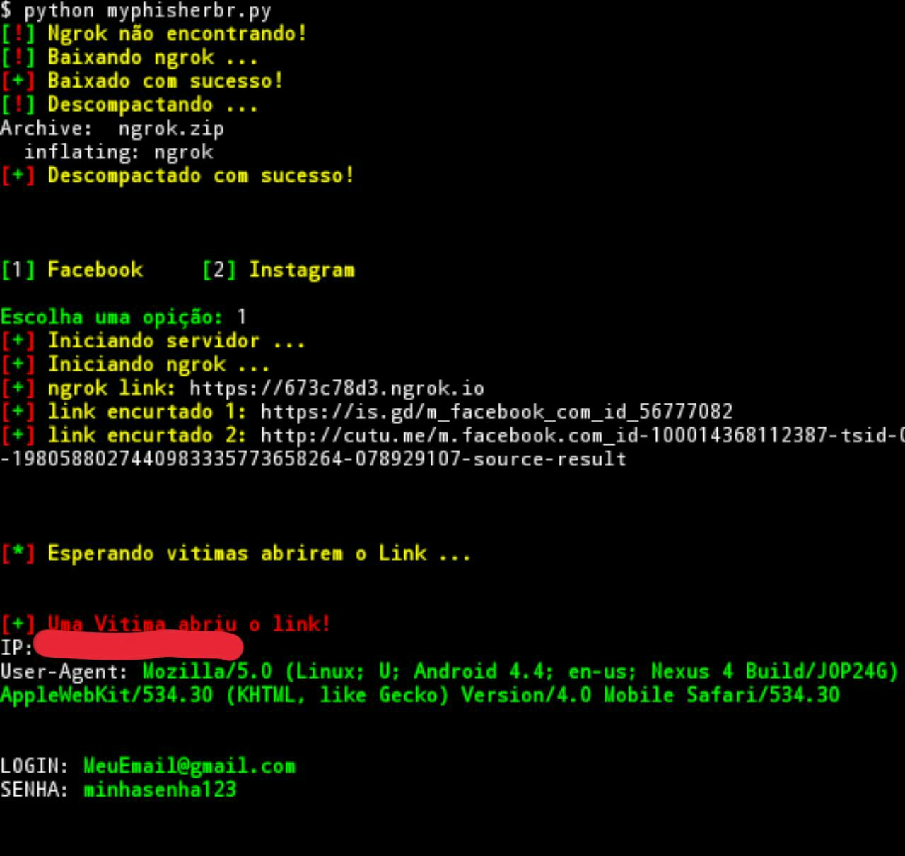

My Phisher Br (version v 1.0)
===============================

Essa ferramenta faz paginas falsas para hackear contas das principais redes sociais.

Usage :
      
      $ apt-get install python3
      $ apt-get install git
      $ git clone https://github.com/h3inAKArr/MyPhisherBr
      $ cd MyPhisherBr
      $ bash install.sh
      $ python3 myphisherbr.py

Menu principal e usando opição 1 (facebook):

Visão da vitima:
  

    
Use com cuidado!

Testado em:
      Termux 
 
